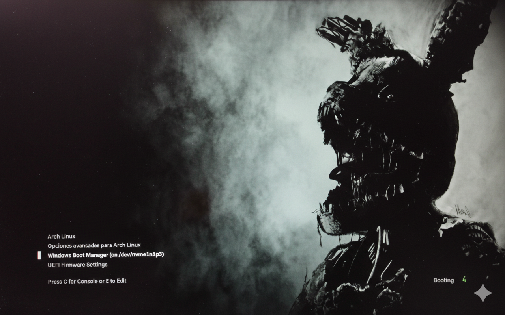

# Springtrap GRUB Theme 



Este es un tema personalizado de GRUB inspirado en Springtrap de Five Nights at Freddy's, diseñado para resoluciones 1920x1200 (16:10).

## Guía de Instalación en Arch Linux

### 1. Requisitos previos
- Tener GRUB instalado y funcionando.
- Acceso a una terminal con privilegios de superusuario (`sudo`).

### 2. Instalar el tema automáticamente
Ejecuta el script de instalación incluido:
```sh
cd script
chmod +x install.sh
./install.sh
```

Este script copiará los archivos del tema, actualizará la configuración de GRUB y aplicará los cambios automáticamente.

### 3. Reinicia y disfruta
Reinicia tu computadora para ver el nuevo tema de GRUB.

---

**Notas:**
- Este tema está optimizado para resoluciones 1920x1200 (16:10). Puede no verse correctamente en otras resoluciones.
- Si quieres puedes cambiar la imagen por una de tu resolución de pantalla pero debe ser JPEG baseline (no progresivo).
- Si tienes problemas, revisa la ruta del tema y los permisos de los archivos.
